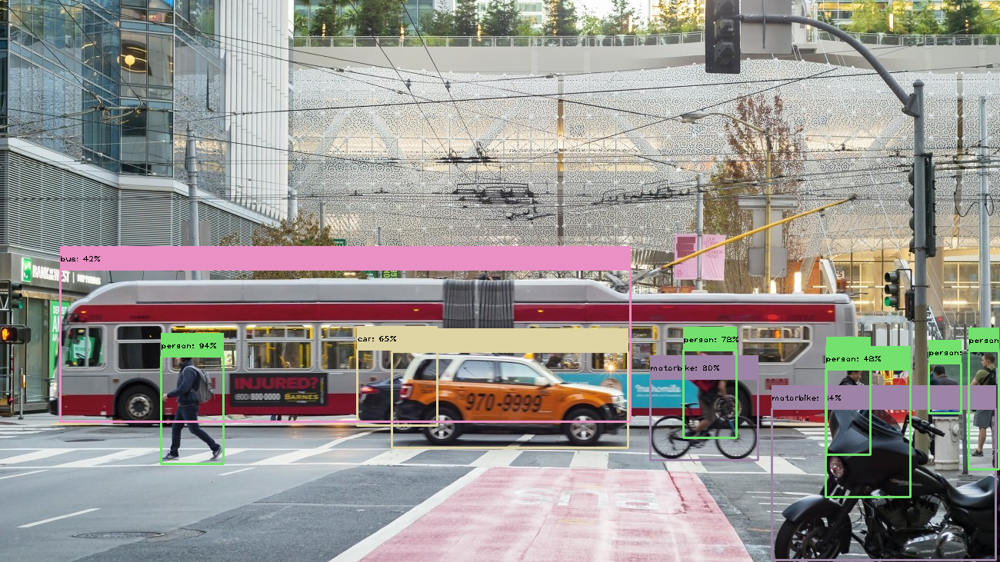
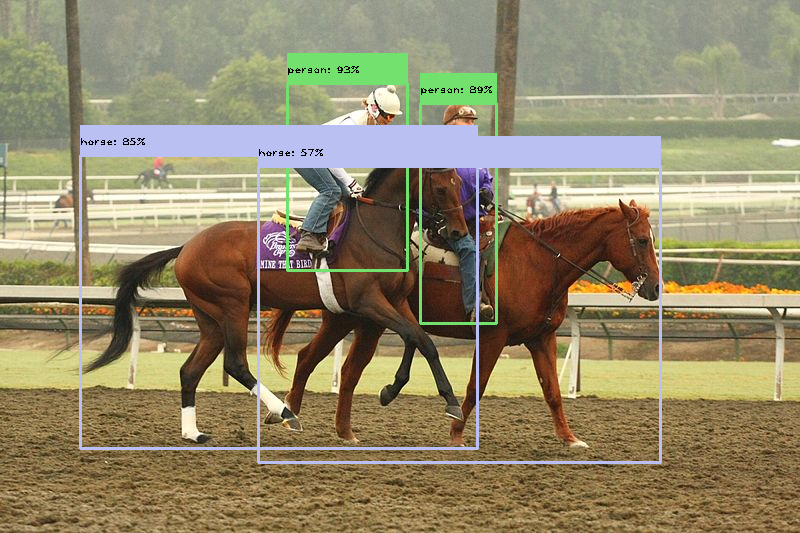

# Object Detection with YOLOv5 and Streamlit

In this project, I trained the YOLOv5 model for object detection and created a Streamlit web application to perform object detection on uploaded images. The YOLOv5 model was trained to detect various objects, and the trained model is integrated into a user-friendly web interface using Streamlit.

## Table of Contents

- [Project Overview](#project-overview)
- [Streamlit Web App](#streamlit-web-app)
- [Installation](#installation)
- [Usage](#usage)
- [Test Results](#test-results)
- [Contributing](#contributing)
- [License](#license)

## Project Overview

I initially trained the YOLOv5 model from scratch using Google Colab and Google Drive. The model was trained to detect a variety of objects, including but not limited to persons, cars, chairs, bottles, and animals. For more details on the training process, refer to the [YOLOv5 repository](https://github.com/ultralytics/yolov5).

## Streamlit Web App

I have created a Streamlit web application that allows users to upload images and perform object detection using the trained YOLOv5 model. The web app provides a user-friendly interface to visualize the detection results and gain insights into the objects present in the uploaded images.

You can test the web app by clicking [here](https://your-web-app-url.com).

## Installation

1. Clone this repository to your local machine:
```git clone https://github.com/mouraffa/RealTime-Object-Detection-YOLOv5.git```


2. Install the required packages from the `requirements.txt` file:

```pip install -r requirements.txt```


## Usage

1. Run the Streamlit web app locally:
```streamlit run Home.py```


2. Access the web app in your web browser and follow the instructions to upload an image and perform object detection.

## Test Results

Here are some examples of test results obtained using the Streamlit web app:

- **Original Image 1**: 
- **Predicted Image 1**: 

- **Original Image 2**: 
- **Predicted Image 2**: 

## Screenshots
[](sc1.jpg)
[](sc2.jpg)
[](sc3.jpg)
[](sc4.jpg)
## Contributing

Contributions are welcome! If you find any issues or would like to enhance the project, feel free to submit pull requests or open issues.

